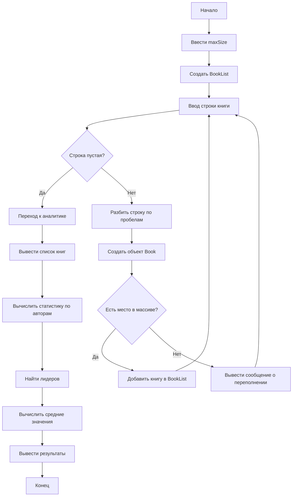

## Отчет по лабораторной работе № 3

#### № группы: `ПМ-2502`

#### Выполнил: `Загидулина Ева Артуровна`

#### Вариант: `6`

### Cодержание:

- [Постановка задачи](#1-постановка-задачи)
- [Математическая модель](#2-математическая-модель)
- [Используемые типы данных и хранение](#3-используемые-типы-данных-и-хранение)
- [Алгоритм работы программы](#4-алгоритм-работы-программы)
- [Блок схема](#5-блок-схема)
- [Программа](#6-программа)
- [Пример работы](#7-пример-работы)

### 1. Постановка задачи
Как я понимаю задачу

Необходимо разработать программу на Java, которая позволяет работать со списком книг.
Каждая книга имеет следующие характеристики:
1. автор
2. название
3. количество страниц
        
На основе списка нужно уметь:
1. добавлять книги
2. выводить весь список
3. считать количество книг определённого автора
4. суммировать страницы конкретного автора
5. строить список авторов с суммарными данными
6. находить автора-лидера по количеству книг или по объёму страниц
7. вычислять средние значения по списку
8. контролировать переполнение списка по максимальному числу книг

Фактически программа должна моделировать простую базу данных книг и авторов с аналитическими функциями.
Ниже приведён полностью оформленный отчёт по твоей задаче в строгой и правильной структуре, как требуют преподаватели.

## 2. Математическая модель
Обозначим:
- B = \{b<sub>1</sub>, b<sub>2</sub>, …, b<sub>n</sub>\} — список книг.
- Каждая книга b<sub>i</sub> описывается тройкой: b<sub>i</sub> = (author<sub> i</sub> , title<sub> i</sub> , pages<sub> i</sub>)
- Множество авторов: A = \{author<sub> 1</sub> , author<sub> 2</sub> , …, author<sub> k</sub>\}

Для каждого автора a<sub>j</sub>:
- количество его книг: count(a<sub>j</sub>) = {b<sub>i</sub> ∈ B | author<sub>i</sub> = a<sub>j</sub>}
- суммарный объём: volume(a<sub>j</sub>) = ∑<sub> b<sub>i</sub> ∈ B, author<sub>i</sub> = a<sub>j</sub></sub> pages<sub>i</sub>
- средний объём: avg(a<sub>j</sub>) = $\frac{volume}{count}$ 


## 3. Используемые типы данных и хранение

1. Класс Book

Хранит одну книгу.

|Поле   | Тип   | Назначение |
|:------|:------|:-----------|
|author |String |Имя автора  |
|title  |String | Название   |
|pages  |int    |Кол-во стр. |

2. Класс AuthorInfo

Хранит данные об авторе:
|Поле        | Тип   | Назначение |
|:-----------|:------|:-----------|
|name        |String |Имя автора  |
|booksCount  |int    |Кол-во книг |
|pagesTotal  |int    |Сумма стр.  |

3. Класс BookList

Хранит список книг.
|Поле        | Тип   | Назначение              |
|:-----------|:------|:------------------------|
|books       |Book[] |Массив книг              |
|size        |int    |Текущее кол-во эл.       |
|maxSize     |int    |Макс. допустимое кол-во  |

## 4. Алгоритм работы программы
 1. Пользователь вводит максимально допустимое число книг.
 2. Создаётся объект BookList.
 3. Пользователь вводит по строкам данные о книгах.
 4. Строка разбивается по пробелам → получаем поля.
 5. Создаётся объект Book.
 6. Книга добавляется в список, если не превышен лимит.
 7. Когда ввод завершён, программа выполняет анализ:
 - вывод всех книг
 - вычисление количества книг указанного автора
 - вычисление суммарных страниц автора
 - формирование списка авторов
 - нахождение авторов-лидеров
 - проверка совпадения лидеров
 - нахождение средних значений.
 8. Вывод результатов.

## 5. Блок-схема


## 6. Программа

1. Класс Author

```java
public class Author {
    private String name;
    private int totalBooks;
    private int totalPages;

    public Author(String name) {
        this.name = name;
        this.totalBooks = 0;
        this.totalPages = 0;
    }

    public void addBook(int pages) {
        totalBooks++;
        totalPages += pages;
    }

    public String getName() {
        return name;
    }

    public int getTotalBooks() {
        return totalBooks;
    }

    public int getTotalPages() {
        return totalPages;
    }

    public double averagePages() {
        return totalBooks == 0 ? 0 : (double) totalPages / totalBooks;
    }

    @Override
    public String toString() {
        return "Автор: " + name + ". Количество книг: " + totalBooks +
                ". Объем страниц: " + totalPages + ".";
    }
}

```
2. Класс Book

``` java
public class Book {
    private String author;
    private String title;
    private int pages;

    public Book(String author, String title, int pages) {
        this.author = author;
        this.title = title;
        this.pages = pages;
    }

    public String getAuthor() {
        return author;
    }

    public String getTitle() {
        return title;
    }

    public int getPages() {
        return pages;
    }

    @Override
    public String toString() {
        return author + " \"" + title + "\". Объем: " + pages + " страниц";
    }
}

```

3. Класс List

```java
public class List {

    private Book[] books;
    private int maxSize;
    private int count;

    public List(int maxSize) {
        this.maxSize = maxSize;
        this.books = new Book[maxSize];
        this.count = 0;
    }

    // 1. Добавление книги
    public boolean addBook(Book b) {
        if (count >= maxSize) {
            System.out.println("Ошибка: список переполнен.");
            return false;
        }
        books[count++] = b;
        return true;
    }

    // 2. Печать списка книг
    public void printList() {
        for (int i = 0; i < count; i++) {
            System.out.println((i + 1) + ". " + books[i]);
        }
    }

    // 3. Количество книг автора
    public int countBooksByAuthor(String author) {
        int k = 0;
        for (int i = 0; i < count; i++) {
            if (books[i].getAuthor().equals(author)) {
                k++;
            }
        }
        return k;
    }

    // 4. Объём страниц автора
    public int pagesByAuthor(String author) {
        int sum = 0;
        for (int i = 0; i < count; i++) {
            if (books[i].getAuthor().equals(author)) {
                sum += books[i].getPages();
            }
        }
        return sum;
    }

    // 5. Формирование списка авторов
    public Author[] createAuthorList() {
        Author[] authors = new Author[count];
        int ac = 0;

        for (int i = 0; i < count; i++) {
            String name = books[i].getAuthor();
            int pages = books[i].getPages();

            Author found = null;

            for (int j = 0; j < ac; j++) {
                if (authors[j].getName().equals(name)) {
                    found = authors[j];
                    break;
                }
            }

            if (found == null) {
                authors[ac] = new Author(name);
                found = authors[ac];
                ac++;
            }

            found.addBook(pages);
        }

        Author[] result = new Author[ac];
        for (int i = 0; i < ac; i++) {
            result[i] = authors[i];
        }
        return result;
    }

    // 6. Печать данных об авторах
    public void printAuthors() {
        Author[] a = createAuthorList();
        for (Author info : a) {
            System.out.println(info);
        }
    }

    // 7. Средний объем книги
    public double averageBookSize() {
        if (count == 0) return 0;
        int total = 0;
        for (int i = 0; i < count; i++) {
            total += books[i].getPages();
        }
        return (double) total / count;
    }

    // 8. Средний объем книг автора
    public double averageBookSizeByAuthor(String author) {
        int total = 0;
        int k = 0;

        for (int i = 0; i < count; i++) {
            if (books[i].getAuthor().equals(author)) {
                total += books[i].getPages();
                k++;
            }
        }
        return k == 0 ? 0 : (double) total / k;
    }

    // 9. Автор с наибольшим количеством книг
    public String topAuthorByBooks() {
        Author[] a = createAuthorList();
        if (a.length == 0) return null;

        Author best = a[0];
        for (Author info : a) {
            if (info.getTotalBooks() > best.getTotalBooks()) {
                best = info;
            }
        }
        return best.getName();
    }

    // 9b. Автор с наибольшим количеством страниц
    public String topAuthorByPages() {
        Author[] a = createAuthorList();
        if (a.length == 0) return null;

        Author best = a[0];
        for (Author info : a) {
            if (info.getTotalPages() > best.getTotalPages()) {
                best = info;
            }
        }
        return best.getName();
    }

    // 10. Совпадают ли лидеры?
    public boolean compareTopAuthors() {
        String byBooks = topAuthorByBooks();
        String byPages = topAuthorByPages();
        return byBooks != null && byBooks.equals(byPages);
    }
}

```

4. TestBooks

```java
import java.util.Scanner;

public class TestBooks {
    public static void main(String[] args) {

        Scanner sc = new Scanner(System.in);

        System.out.print("Введите максимальное количество книг: ");
        int max = sc.nextInt();
        sc.nextLine(); // очистка

        List list = new List(max);

        System.out.print("Введите количество книг, которые хотите добавить: ");
        int n = sc.nextInt();
        sc.nextLine();

        System.out.println("\nВведите каждую книгу ОДНОЙ СТРОКОЙ:");
        System.out.println("Формат: Автор Название Страницы (Название и имя автора книги пишите слитно)");
        System.out.println("Пример: ПетрИванов СказОЖизни 150\n");

        for (int i = 0; i < n; i++) {
            System.out.print("Книга " + (i + 1) + ": ");
            String line = sc.nextLine();

            String[] parts = line.split(" ");

            String author = parts[0];
            String title = parts[1];
            int pages = Integer.parseInt(parts[2]);

            list.addBook(new Book(author, title, pages));
        }

        System.out.println("\nСписок книг");
        list.printList();

        // Главное меню
        boolean running = true;
        while (running) {
            System.out.println("\n=== МЕНЮ АНАЛИЗА ===");
            System.out.println("0. Завершить анализ");
            System.out.println("1. Анализировать автора");
            System.out.println("2. Сравнить всех авторов");
            System.out.print("Выберите действие (0-2): ");

            int choice = sc.nextInt();
            sc.nextLine(); // очистка

            switch (choice) {
                if (choice == 0) {
                    running = false;
                    System.out.println("Анализ завершен.");
                    break;
                }

                else if (choice == 1) {
                    // Анализ конкретного автора
                    System.out.println("\n=== АНАЛИЗ АВТОРА ===");
                    System.out.print("Введите имя автора для анализа: ");
                    String name = sc.nextLine();

                    System.out.println("\nРезультаты анализа автора '" + name + "':");
                    System.out.println("Книг автора: " + list.countBooksByAuthor(name));
                    System.out.println("Страниц автора: " + list.pagesByAuthor(name));
                    System.out.println("Средний объём книг автора: " + list.averageBookSizeByAuthor(name));
                    break;
                }

                else if (choice == 2) {
                    // Сравнение всех авторов
                    System.out.println("\n=== СРАВНЕНИЕ ВСЕХ АВТОРОВ ===");

                    System.out.println("Список авторов:");
                    list.printAuthors();

                    System.out.println("\nОбщая статистика:");
                    System.out.println("Средний объём всех книг: " + list.averageBookSize());
                    System.out.println("Автор с наибольшим числом книг: " + list.topAuthorByBooks());
                    System.out.println("Автор с наибольшим числом страниц: " + list.topAuthorByPages());
                    System.out.println("\nСовпадают ли лидеры? " + list.compareTopAuthors());
                    break;
                }

                else {
                    System.out.println("Неверный выбор. Попробуйте снова.");
                    break;
                }
            }
        }

        sc.close();
    }
}
```
## 7. Пример работы
- Input:
    ```
    Введите максимальное количество книг: 5
    Введите количество книг, которые хотите добавить: 5
    ```

- Output:
    ```
    Введите каждую книгу ОДНОЙ СТРОКОЙ:
    Формат: Автор Название Страницы (Название и имя автора книги пишите слитно)
    Пример: ПетрИванов СказОЖизни 150
    ```


- Input:
    ```
    Книга 1: Дюма ТриМушкетера 1240
    Книга 2: Дюма ГрафМонтеКристо 1650
    Книга 3: Пушкин Выстрел 87
    Книга 4: Пушкин Дубровский 185
    Книга 5: Булгаков Морфий 350

    ```

- Output:
    ```
    Список книг
    1. Дюма "ТриМушкетера". Объем: 1240 страниц
    2. Дюма "ГрафМонтеКристо". Объем: 1650 страниц
    3. Пушкин "Выстрел". Объем: 87 страниц
    4. Пушкин "Дубровский". Объем: 185 страниц
    5. Булгаков "Морфий". Объем: 350 страниц

    ```
- Output:
    ```
    === МЕНЮ АНАЛИЗА ===
        0. Завершить анализ
        1. Анализировать автора
        2. Сравнить всех авторов

    ```
 - Input:
    ```
    Выберите действие (0-2): 1

    ```   
- Output:
    ```
    === АНАЛИЗ АВТОРА ===
    ```
 - Input:
    ```
    Введите имя автора для анализа: Дюма
    ```   
- Output:
    ```
    Результаты анализа автора 'Дюма':
        Книг автора: 2
        Страниц автора: 2890
        Средний объём книг автора: 1445.0
    ```
- Output:
    ```
   === МЕНЮ АНАЛИЗА ===
    0. Завершить анализ
    1. Анализировать автора
    2. Сравнить всех авторов
    ```
- Input:
    ```
    Выберите действие (0-2): 2
    ```   

- Output:
    ```
  === СРАВНЕНИЕ ВСЕХ АВТОРОВ ===
        Список авторов:
        Автор: Дюма. Количество книг: 2. Объем страниц: 2890.
        Автор: Пушкин. Количество книг: 2. Объем страниц: 272.
        Автор: Булгаков. Количество книг: 1. Объем страниц: 350.
        
        Общая статистика:
        Средний объём всех книг: 702.4
        Автор с наибольшим числом книг: Дюма
        Автор с наибольшим числом страниц: Дюма

        Совпадают ли лидеры? true
    ```

- Output:
    ```
         === МЕНЮ АНАЛИЗА ===
        0. Завершить анализ
        1. Анализировать автора
        2. Сравнить всех авторов
    ```

- Input:
    ```
    Выберите действие (0-2): 0
    ```   
- Output:
    ```
         Анализ завершен.
    ```


